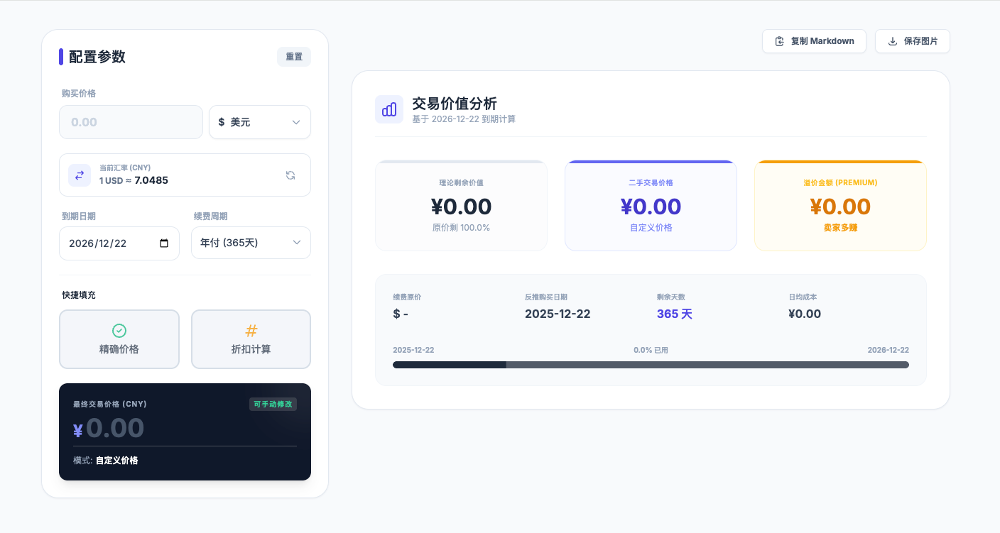

# 📊 VPS 交易价值计算器 (VPS Value Calculator)

[](https://hub.docker.com/r/nimeng1222/vps-calculator)
[](LICENSE)
[](https://www.docker.com/)

一个极简、现代化且高颜值的 VPS 剩余价值计算器，专为主机交易（MJJ）圈子设计。
基于 **Python Flask** + **Vue.js** + **Tailwind CSS** 构建，支持 Docker 一键秒级部署。




## ✨ 核心特性

- **📅 智能周期计算**：抛弃繁琐的购买日期，直接输入**到期日期**，自动反推购买时间并计算剩余天数。
- **💱 实时汇率支持**：后端自动抓取最新汇率（USD/EUR/GBP/JPY 等），同时支持**手动修正**汇率，精准对齐交易时刻。
- **🏷️ 多种交易模式**：
  - **精确价格**：一键自动填入理论剩余价值。
  - **折扣模式**：支持一键应用 95 折、8 折等常见折扣，自动计算折后价。
  - **手动模式**：自由输入交易价格，系统自动分析是**溢价**还是**捡漏**。
- **📋 交易文案生成**：一键生成排版精美的 Markdown 交易帖内容，直接复制即可发帖。
- **🖼️ 分享图片生成**：前端实时渲染高清交易报表图片，方便在群聊或频道分享。
- **📱 完全响应式**：无论是电脑大屏还是手机端，UI 体验如丝般顺滑。

## 🚀 快速部署

你可以选择以下任意一种方式进行部署。

### 方式一：Docker CLI（推荐尝鲜）

直接运行以下命令即可启动：

```bash
docker run -d \
  --name vps_calculator \
  --restart always \
  -p 5000:5000 \
  -e FLASK_ENV=production \
  nimeng1222/vps-calculator:latest

```

启动后，访问 `http://你的服务器IP:5000` 即可使用。

---

### 方式二：Docker Compose（推荐长期运行）

创建一个 `docker-compose.yml` 文件：

```yaml
version: '3.8'

services:
  vps-calc:
    image: nimeng1222/vps-calculator:latest
    container_name: vps_calculator
    restart: always
    ports:
      - "5000:5000"  # 左侧端口可自定义，例如 "8080:5000"
    environment:
      - FLASK_ENV=production

```

然后运行：

```bash
docker-compose up -d

```

## 📖 使用指南

1. **配置参数**：填写 VPS 的续费原价、选择币种（支持手动修改汇率）、设置到期日期。
2. **选择模式**：
* 点击 **「精确价格」**：自动填入理论剩余价值。
* 点击 **「折扣计算」**：选择折扣比例（如 8 折），自动计算折后价。
* **手动输入**：直接在价格框输入你想卖的价格。


3. **获取结果**：右侧仪表盘会实时显示日均成本、剩余比例，以及**溢价/优惠金额**分析。
4. **分享**：点击右上角 **「复制 Markdown」** 或 **「保存图片」**。

## 🛠️ 技术栈

* **前端**：Vue.js 3, Tailwind CSS, html2canvas
* **后端**：Python Flask
* **部署**：Docker

## 🤝 贡献与反馈

如果你有任何建议或发现了 Bug，欢迎提交 [Issue](https://www.google.com/search?q=https://github.com/nimeng1222/vps-calculator/issues) 或 Pull Request。

---

*Made with ❤️ for the VPS community.*

```

```
